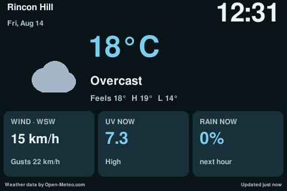
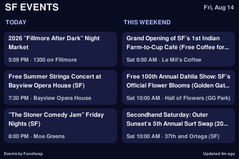
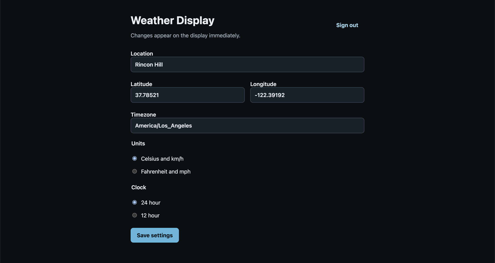

# Raspberry Pi Weather Display

An always-on, low-glare 480×320 weather and San Francisco events dashboard for a Raspberry Pi 3B. It uses a small native Pygame renderer and an in-process Flask settings server. Weather and location search come from the free, keyless Open-Meteo APIs; event listings come from Funcheap.



_Live 480×320 screenshot captured from the installed Raspberry Pi display._



_Live Pi capture after the weekend-date fix: three current-day and three unique weekend events, ranked from the selected Funcheap categories._

The default location is Rincon Hill, San Francisco (`37.78521, -122.39192`) with Celsius, km/h, and a 24-hour clock. The display rotates between weather for 20 seconds and events for 10 seconds. Weather refreshes every 10 minutes and events refresh hourly; both retain their last good cached data through network outages.

The events scene shows three `TODAY` listings and three unique `THIS WEEKEND` listings, each with its start time and venue. Today's data comes from Funcheap's structured RSS feed; upcoming Saturday and Sunday data comes from its machine-readable date pages. The integration excludes expired, duplicate, malformed, non-San Francisco, and Sponsored entries. It ranks exact selected-category matches first, then Top Picks and soonest start time, while unselected categories fill any remaining cards.

## Supported hardware and OS

- Raspberry Pi 3B
- 480×320 landscape SPI display
- Raspberry Pi OS Bookworm 64-bit Desktop using X11
- The `piscreen` DRM overlay configuration shown below

Wayland, Raspberry Pi OS Lite, other resolutions, and framebuffer-only setups are not supported by the installer. The app may work on them with manual adaptation.

## Screen setup

On a clean Bookworm Desktop image, update stable OS packages (do not use `rpi-update`, which is intended for experimental firmware):

```sh
sudo apt update
sudo apt full-upgrade
sudo raspi-config
```

In `raspi-config`, select X11 under Advanced Options → Wayland, enable SPI, and configure Desktop Autologin. Add this proven overlay to `/boot/firmware/config.txt`:

```ini
dtoverlay=piscreen,speed=18000000,drm
```

Reboot and confirm `xrandr` reports `480x320`. Rotation varies by the physical mounting and display board; apply it in the board's X11 configuration before installing this service.

For a touchscreen, install and run the X11 calibration utility while the screen is in its final rotation:

```sh
sudo apt install xinput-calibrator
xinput_calibrator
sudo mkdir -p /etc/X11/xorg.conf.d
sudo nano /etc/X11/xorg.conf.d/99-calibration.conf
```

Copy the complete `Section "InputClass"` emitted by `xinput_calibrator` into that file, then reboot. Calibration numbers are device- and rotation-specific; do not copy values from another panel. Touch is not required by the dashboard and is not used for settings.

If the screen already works at 480×320 under X11 with `dtoverlay=piscreen,speed=18000000,drm`, leave its working boot and calibration configuration intact and proceed directly to installation.

## Install

Clone this repository on the Pi, then run:

```sh
cd rpi-weather-display
sudo WEATHER_DISPLAY_PIN='choose-a-private-pin' scripts/install.sh
```

The installer validates Bookworm, X11, and the active screen mode; installs stable APT packages; creates `/opt/weather-display/.venv`; and installs a non-root systemd service. It sets the hostname to `weather-display`, enables mDNS, and disables X11 blanking/DPMS when the service starts.

The PIN is written with root-only permissions to `/etc/weather-display/environment`. Settings, the session secret, cached weather, and date-partitioned event caches live in `/var/lib/weather-display`. None are inside the Git checkout. `WEATHER_DISPLAY_PIN` is mandatory; the service exits immediately if it is absent.

From a phone or computer on the same LAN, open:

- `http://weather-display.local:8080`
- `http://<pi-ip-address>:8080` if mDNS is unavailable

The settings app searches places, ZIP codes, and neighborhoods; allows exact coordinate/timezone edits; switches metric/imperial units and 12/24-hour time; configures each scene from 5–300 seconds; and prioritizes any OR-based selection of Funcheap's official categories. A save immediately restarts the cycle on weather.



_The responsive LAN settings app, shown in a desktop browser._

## Service management and updates

```sh
sudo systemctl status weather-display
sudo journalctl -u weather-display -f
sudo systemctl restart weather-display
sudo systemctl stop weather-display
```

To update, pull the desired revision in the source clone and rerun the installer with the existing PIN:

```sh
git pull --ff-only
sudo WEATHER_DISPLAY_PIN='your-existing-pin' scripts/install.sh
```

The health endpoint is intentionally unauthenticated for LAN monitoring:

```sh
curl http://weather-display.local:8080/healthz
```

It reports service state, display state, weather/event errors, and both cache ages. It never includes the PIN or session secret.

## Development and deterministic previews

```sh
python3 -m venv .venv
. .venv/bin/activate
pip install -r requirements-dev.txt
pytest
SDL_VIDEODRIVER=dummy python -m weather_display.preview --scenario day --output examples/dashboard.png
```

Weather preview scenarios are `day`, `night`, `rain`, `fog`, `extreme`, `long-location`, `stale`, and `no-data`. Event scenarios are `events`, `events-long`, `events-stale`, and `events-unavailable`. Every preview is deterministic and exactly 480×320.

For a development window instead of fullscreen:

```sh
WEATHER_DISPLAY_PIN=dev-pin WEATHER_DISPLAY_DATA_DIR=/tmp/weather-display-data \
WEATHER_DISPLAY_WINDOWED=1 python -m weather_display.main
```

## Troubleshooting

- **Black screen or SDL/X11 error:** confirm the Desktop session is running under X11, `DISPLAY=:0`, the user's `.Xauthority` exists, and `xrandr` sees 480×320.
- **Service starts before the desktop:** inspect `journalctl`; after the autologin desktop is ready, restart the service. The unit orders itself after the display manager and retries failures.
- **Screen blanks:** run `DISPLAY=:0 xset q`; the unit runs `xset s off` and `xset -dpms` at each start. Also disable any desktop screensaver.
- **Settings site is unreachable:** confirm both devices are on the same LAN, port 8080 is allowed, and try the Pi's IP address. Check `systemctl status avahi-daemon` for `.local` naming.
- **Weather is stale:** `/healthz` exposes cache age and the most recent sanitized fetch error. Cached data remains on screen while requests retry.
- **Events are stale:** `/healthz` separately exposes event cache age and the latest partial or complete Funcheap refresh error. Each date keeps its last successful cache if another date fails.
- **Wrong local time:** select a search result with the proper timezone or edit the IANA timezone in settings. The Pi's system timezone does not control the dashboard clock.
- **Touch coordinates are wrong:** recalibrate after finalizing screen rotation and replace `/etc/X11/xorg.conf.d/99-calibration.conf` with the generated section.

## Security and data attribution

The web UI is intended for a trusted private LAN. Authentication uses a constant-time PIN check, per-IP failed-login throttling, HTTP-only SameSite cookies, CSRF tokens, and same-origin mutation checks. Plain HTTP cannot provide transport confidentiality; use a trusted reverse proxy with HTTPS and set `WEATHER_DISPLAY_COOKIE_SECURE=1` if that is required.

Weather data by [Open-Meteo.com](https://open-meteo.com/) under [CC BY 4.0](https://open-meteo.com/en/license). Event listings by [Funcheap](https://sf.funcheap.com/). The active source attribution is permanently visible on the physical dashboard.

Application source is licensed under GPL-3.0-only. See [LICENSE](LICENSE).
